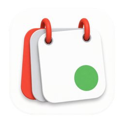
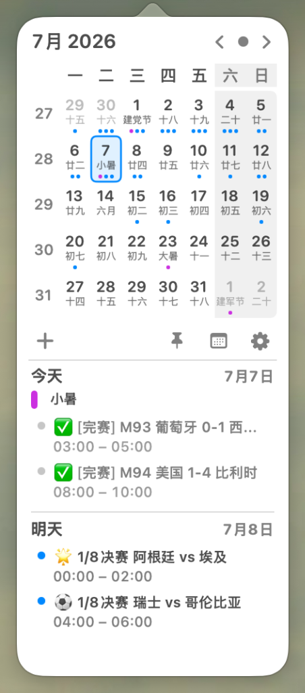
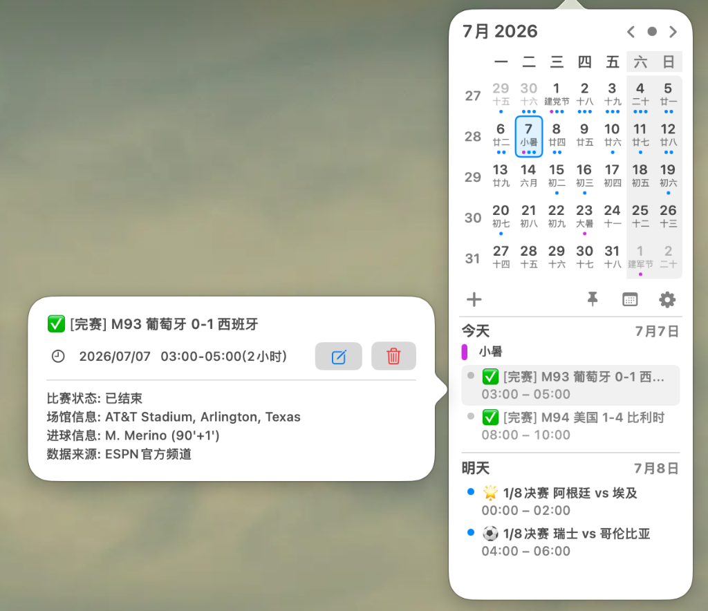

<p align="center">
  
</p>

<h1 align="center">Menucal</h1>

<p align="center">一款轻量、原生的 macOS 菜单栏日历。</p>

<p align="center">
  
  <a href="https://github.com/ervinsae/Menucal/releases/latest"></a>
  
</p>

Menucal 常驻菜单栏，用紧凑的弹窗展示月历与近期日程，并提供农历、节气、中国节假日和系统日历管理能力。

## 功能

- 公历、农历、24 节气、传统节日与中国法定节假日。
- 读取、新增、编辑和删除系统日历事件，支持日历筛选与完整事件详情。
- 自定义每周起始日、周数、周末高亮、外观和菜单栏显示格式。
- 日程链接可直接打开，与会人员状态清晰可见。
- 支持开机自启动和 GitHub Release 更新检查。
- 支持整点报时。

## 截图

<p>
  
  &nbsp;&nbsp;&nbsp;&nbsp;
  
</p>

## 安装

1. 从 [GitHub Releases](https://github.com/ervinsae/Menucal/releases/latest) 下载最新的 `Menucal-*.dmg`。
2. 打开 DMG，将 `Menucal.app` 拖入“应用程序”。
3. 首次启动时，根据系统提示授予日历访问权限。

当前 Release 使用 ad-hoc 签名，尚未进行 Apple Developer ID 签名与公证。如果 macOS 阻止启动，请右键点击应用并选择“打开”，或前往“系统设置 -> 隐私与安全性”选择“仍要打开”。

## 本地开发

```bash
git clone https://github.com/ervinsae/Menucal.git
cd Menucal
open MacCalendar.xcodeproj
```

Menucal 使用 SwiftUI、AppKit、EventKit 和 AVFoundation 开发，最低支持 macOS 14.6。

## 隐私

日历事件的读取和修改均通过系统 EventKit 在本机完成，不会上传日历内容。只有在手动检查或下载更新时，Menucal 才会访问 GitHub Release。

## 致谢

- [MacCalendar](https://github.com/ervinsae/MacCalendar)：Menucal 基于该项目 fork 后持续改造。
- [Itsycal](https://www.mowglii.com/itsycal/)：弹窗交互与视觉方向参考。
- [NateScarlet/holiday-cn](https://github.com/NateScarlet/holiday-cn)：中国法定节假日数据来源。

## 开源协议

本项目基于 MIT 协议开源，详见 [LICENSE](LICENSE)。
